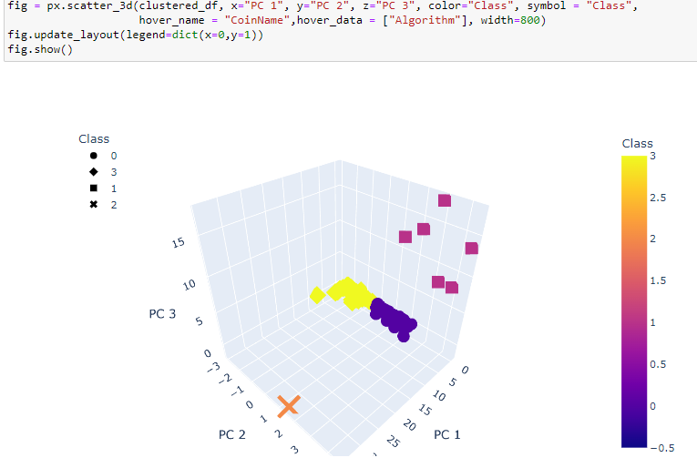
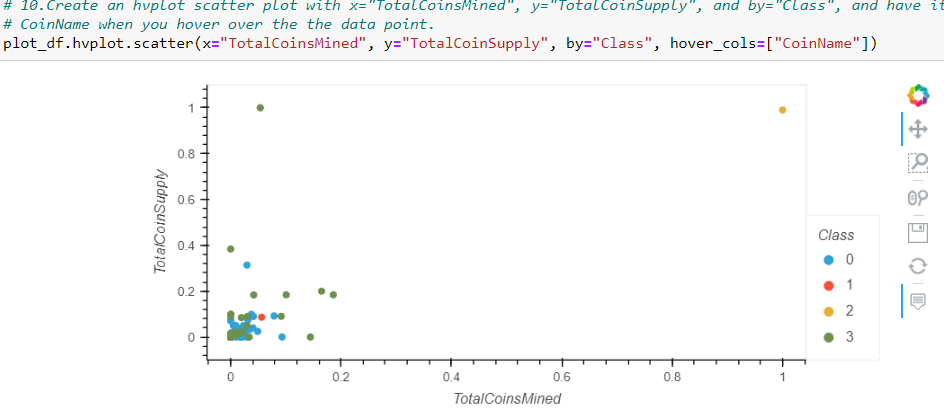
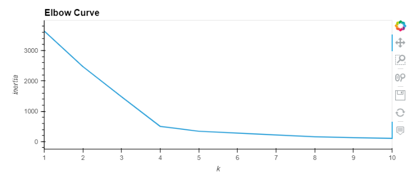

# Unpsupervised Machine Learning (ML) Cryptocurrencies
## Overview:
We use unsupervised learning when we don't yet know the question we're asking of the data. We just want to figure out if there is anything at all the data can tell us for this project.
### Purpose: 
This project's purpose is to create an analysis for clients mainly for 'Accountability Accounting' investment bank who is preparing to get into the cryptocurrency market. Analysis includes what cryptocurrencies are on the trading market and how they could be grouped to create a classification system for this new investment type.
### Tools:
Using Python language, Jupyter notebooks web app, hvplot, Sklearn, pandas, plotly libraries 
## Analysis:
The data is a .csv file and will need to be processed to fit the machine learning models. Since there is no known output for what we are looking for we can use unsupervised learning. To group the cryptocurrencies, we'll use clustering algorithm. Primarily the K-means algorithm, the main unsupervised algorithm that groups similar data into clusters, determines the best number of centroids for K-means using the elbow curve and next building on this by speeding up the process we'll use principal component analysis (PCA), which employs many different features.
First need to find answers to questins such as What data is available?
What type of data is available? What data is missing?What data can be removed?
The next step is data processing. For data processing, the focus is on making sure the data is set up for the unsupervised learning model, which requires the following:
- Null values are handled.
- Only numerical data is used.
- Values are scaled. In other words, data has been manipulated to ensure that the variance between the numbers won't skew results.
Next is Data Transformation; transforming your data into a convenient way for others to use in the future. After clustering using K-means method is applied. Clustering is a type of unsupervised learning that groups data points together. This group of data points is called a cluster. K represents how many clusters there will be. These clusters are then determined by the means of all the points that will belong to the cluster.
After clustering results are visualized. We use 3D hvplot a graphing library that allows deeper exploration of the data as seen in the image below. There are 4 distinct groups. It appears there are some overlapping of groups. Four groups of data are created. Class 2 and 1 are not overlapping but class 0 and 3 are overlapping. Class 2 is an outlier which is a BitTorrent. Class 1 is VeChain, Wavesm, Poanetworks, LitecoinCash, AcuteAngleCloud and biblePay, all grouped together.
Class 0 and Class 3 also grouped.

The below image shows us the hvplot scatter plot. Used the MinMaxScaler().fit_transform method to scale the TotalCoinSupply and TotalCoinsMined and Class to draw the plot with the number of clusters to make as arguments. Class 0 and 3 looks like the data points are mixed a lot. Plotting data with more than two data points in a 2D plot might show the true clustering. This plot shows Class 2 BitTorrent as outliar. Class 3 TurtleCoin as well as na outlier. The rest are more grouped together.

## Summary:
Using the elbow curve we created 4 clusters to use for this project as seen in the image below.

 Elbow curve helps narrow down the number of clusters we should use. Used feature elimination using PCA from the dataset to increase and maintain interpretability. With PCA we are reducing it to 3 classes. With the 3D plotting clusters are grouped to give an overall view of each crypto currency company. Without the clustering method it is very difficult to inpret the data and find the trends.